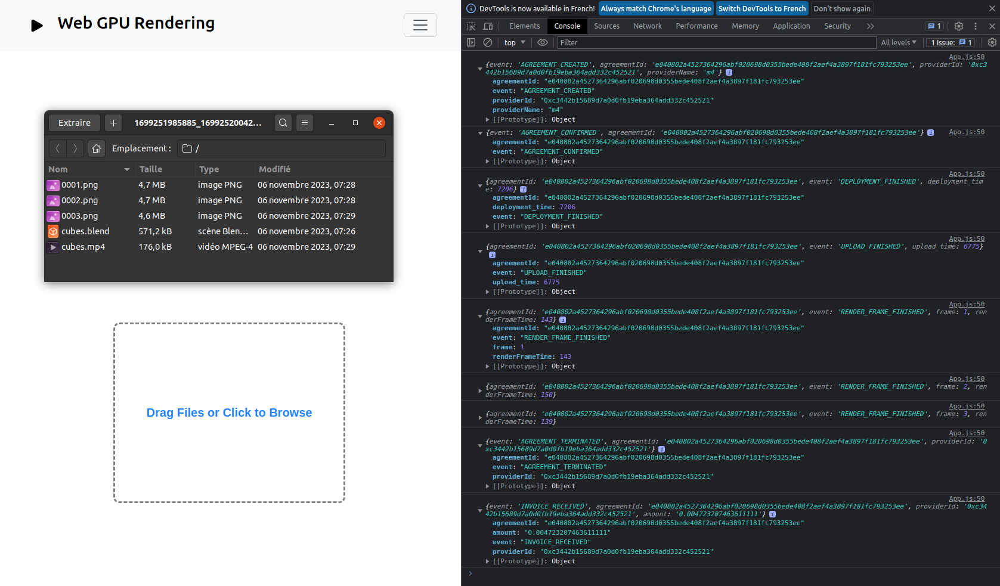

# Web GPU Rendering
Drag, drop, render repeate

Browser-based interface to render blender files using GPU providers on Golem Network.

- Requirements (Server side): Yagna, Docker, zip, Blender 3.5
  
The input allows to select/drag'n'drop and upload up to 5 .blend files.  
A zip file is downloaded at the end of each file rendered with the frames, the video and the blender file inside.  

```
git clone -b error_handling_norbert https://github.com/konradbjk/web-gpu-rendering.git  
```

- Backend (NodeJS)

```
docker run --name mysql -e MYSQL_ROOT_PASSWORD=rootpassword -e MYSQL_USER=user -e MYSQL_PASSWORD=userpassword -e MYSQL_DATABASE=mydb -p 3306:3306 -d mysql  

cd backend  
npm install  
npm start  
```
Docker image from https://github.com/norbibi/docker_backend_web_rendering can be used to run the backend.

- Frontend (ReactJS)
  
```
cd frontend  
npm install  
npm start  
```

<p align="center">
	 
</p>
