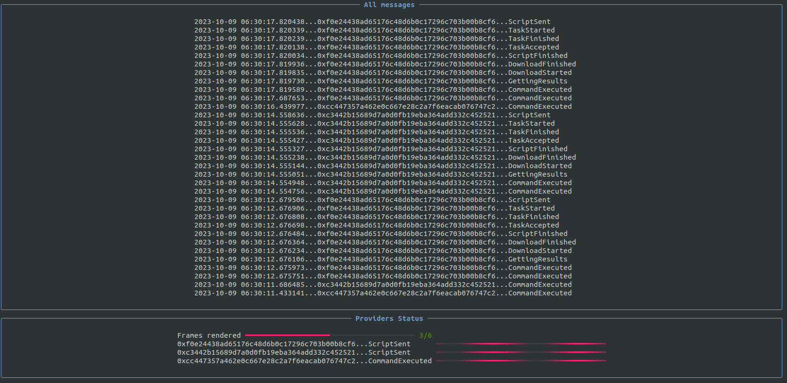
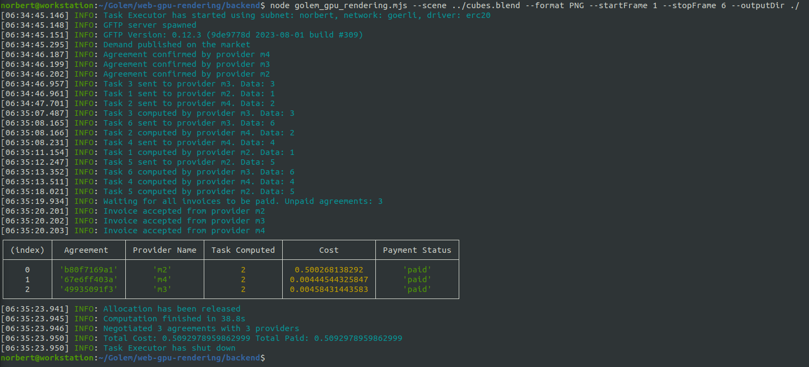
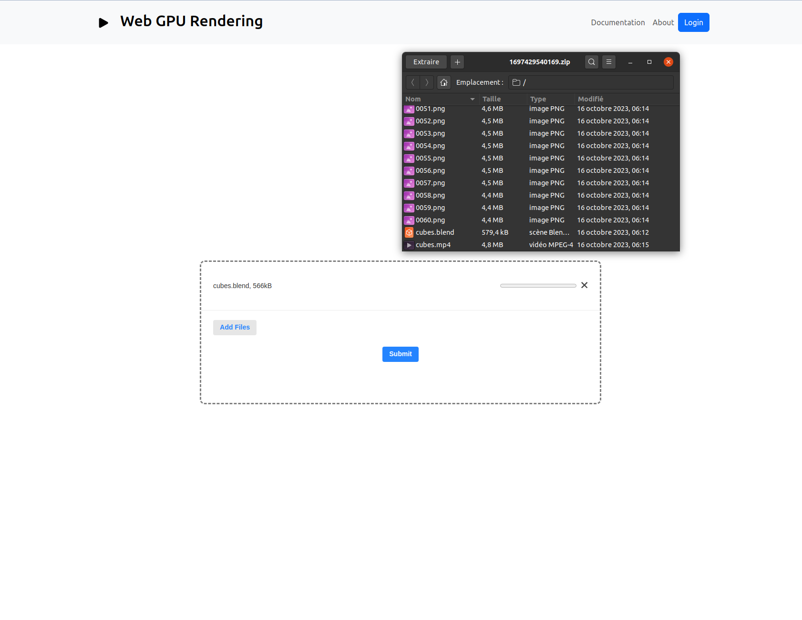

# Web GPU Rendering
Drag, drop, render repeate

Browser-based interface to render blender files using GPU providers on Golem Network.

## Stage 1 - Terminal App
- Python (initial version)
```
cd backend
python3 golem_gpu_rendering.py --scene ../cubes.blend --format PNG --start-frame 1 --stop-frame 6 --output-dir ./
```

<p align="center">
	 
</p>

- JS (code to use in final app)
```
cd backend
node golem_gpu_rendering.mjs --scene ../cubes.blend --format PNG --startFrame 1 --stopFrame 6 --outputDir ./
```

<p align="center">
	 
</p>


## Stage 2 - WebUI

- Requirements (Server side): Yagna, Docker, zip, Blender 3.5
  
The input allows to select/drag'n'drop and upload up to 5 .blend files.  
A zip file is downloaded at the end of each file rendered with the frames, the video and the blender file inside.  

- Backend (NodeJS)

```
docker run --name mysql -e MYSQL_ROOT_PASSWORD=rootpassword -e MYSQL_USER=user -e MYSQL_PASSWORD=userpassword -e MYSQL_DATABASE=mydb -p 3306:3306 -d mysql  

cd backend  
npm install  
npm start  
```

- Frontend (ReactJS)
  
```
cd frontend  
npm install  
npm start  
```

<p align="center">
	 
</p>
